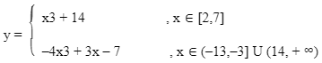

# First lab
#### For a given x, find out what range it fits in and evaluate the corresponding equation.

There are two requirements for this lab **(first.c, second.c)**:
- Using relational operators (logical operators **not allowed**)
- Logical operators **required**
